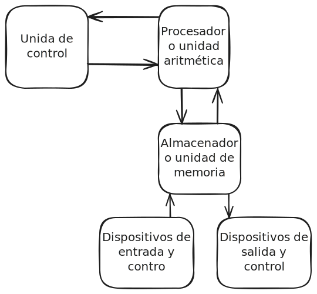

\-\-- lang: en title: Redes de comunicación industrial viewport:
width=device-width, initial-scale=1.0, maximum-scale=1.0,
user-scalable=no \-\-- ::: reveal ::: slides ::: section \#### Tema 2
\## Sistemas digitales \[Maestro: \[Francisco Ruvalcaba
Grandos\](https://franciscoruvalcaba.carrd.co/)\]{.small} ::: :::
section \## Diagrama a bloques de una computadora digital ::: {.r-stack
.justify-center}
\[\{.fragment}\](https://excalidraw.com/#json=KjekrqPQzDEWBoq8tHDbt,HW2n3GKrLR8YEPw5cpAADw)
::: ::: ::: section ::: section \# Sistemas Numéricos
{#sistemas-numéricos style=\"color:dodgerblue\"} ::: ::: section Un
sistema numérico es un conjunto de símbolos, reglas y operaciones que se
utilizan para representar y manipular cantidades numéricas. Incluye:
Símbolos o dígitos Base o radix Reglas de formación Operaciones ::: :::
section \## Sistema base 10 ::: ::: section \## Sistema base 2 ::: :::
section \## Sistema Octal ::: ::: section \## Sistema Hexadecimal :::
::: section \## Conversiones ::: ::: ::: section \## Códigos binarios -
BDC - Esceso a 3 - 84-2-1 - 2421 - (Biguinario)5043210 ::: ::: section
Códigos binarios para dígitos decimales ::: ::: section \## Códigos de
detección de error - Bit de paridad - Código reflejado ::: ::: section
\### Códigos alfanuméricos ::: ::: {.section markdown=\"\"
separator=\"\^\-\--\" separator-vertical=\"\^\\\\n\"
separator-notes=\"\^Note:\"} ::: ::: :::
